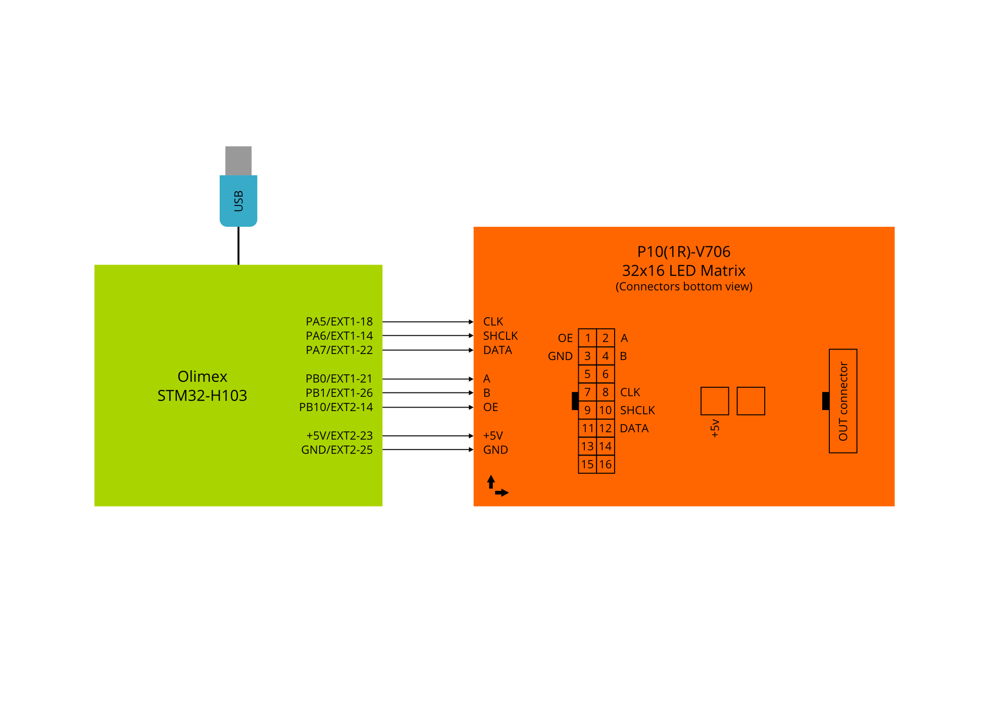

# STM32 USB Led Matrix Real Time Drawing

### - Modules connection

### - Qt/C++ Drawing App 
:grey_exclamation:USB device detected by Vendor ID and Product ID

### - YouTube demo video URL
https://www.youtube.com/watch?v=PMLNQ5mM47Y
