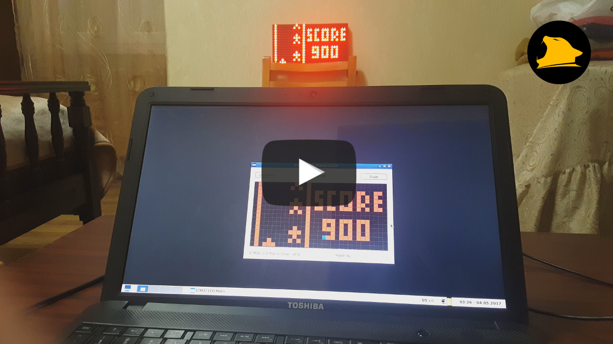

# STM32 USB Led Matrix Real Time Drawing

###How to...
1. Connect modules as shown on "Connection.png"
2. Flash firmware into MCU
3. Run "Qt Project/Linux AMD64 Binary/Servo" and press "Connect" button
4. Servo continiously updates position to selected degree

:grey_exclamation:USB device detected by Vendor ID and Product ID

:grey_exclamation:PC Binaries built for Linux AMD64, but you can build it for any other platform with QtCreator

###Project demo Video/Photo
- YouTube demo video URL: https://www.youtube.com/watch?v=ZbzctbtXEos
- Yandex Disk folder URL: https://yadi.sk/d/m7c2OU8C33pRzm
